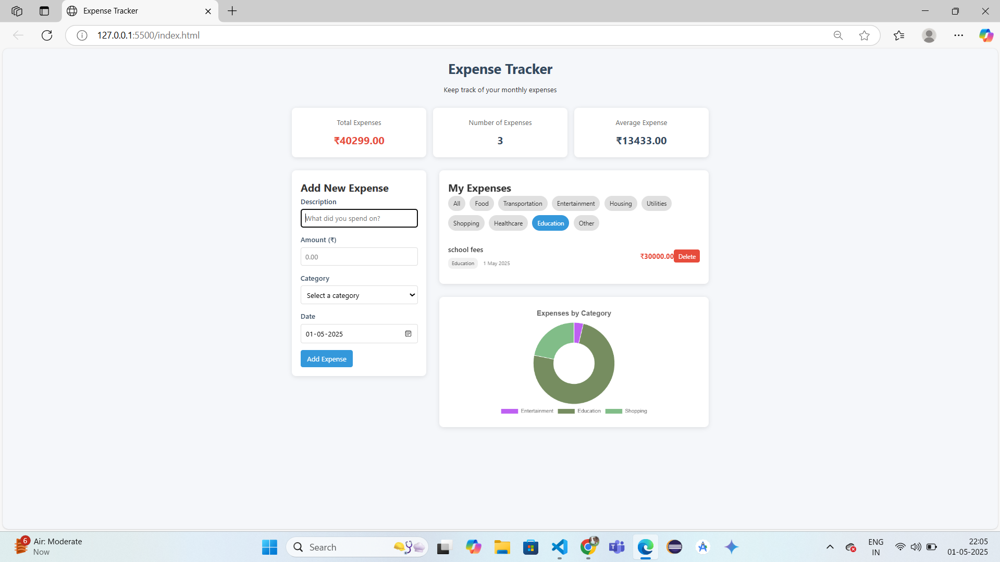

# 💸 Expense Tracker

A simple yet powerful web application to track your monthly expenses. Built with HTML, CSS, and vanilla JavaScript, this application allows you to manage and visualize your spending habits effectively.

---

## ✨ Features

- **Add expenses** with description, amount, category, and date
- **View and filter** expenses by different categories
- **Track statistics** like total expenses, count, and average
- **Visualize spending** with a dynamic chart showing expenses by category
- **Persistent storage** using localStorage to save your data between sessions
- **Responsive design** that works on both desktop and mobile devices

---

## 🛠️ Technologies Used

- **HTML5** - For structure and layout
- **CSS3** - For styling and responsive design
- **JavaScript** - For interactive functionality
- **Chart.js** - For data visualization
- **LocalStorage API** - For data persistence

---

## 🚀 Deployed on

- https://onkar-kambale.github.io/Expense-Tracker/

---

### ➕ Adding Expenses

1. Fill in the expense details in the form:
   - Description (What you spent on)
   - Amount (in ₹)
   - Category (Food, Transportation, etc.)
   - Date

2. Click "Add Expense" to save the expense.

---

## 🎥 Video 

---

## 🌐 Browser Compatibility

Works with all modern browsers:
- Chrome
- Firefox
- Safari
- Edge

---

## 📄 License

This project is licensed under the MIT License - see the LICENSE file for details.
